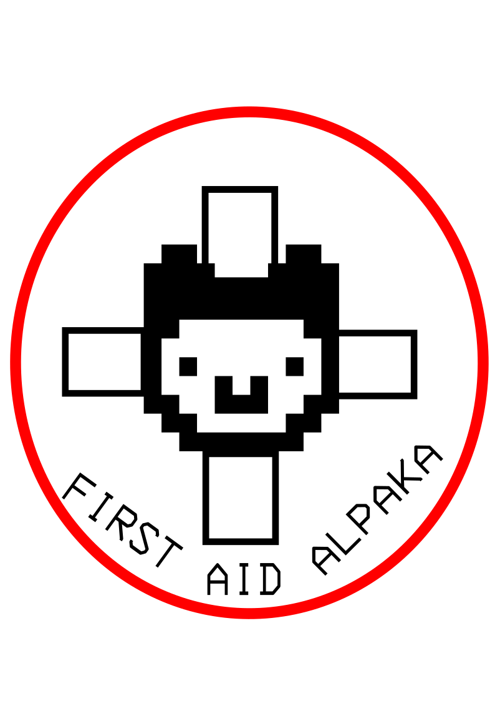

  # FIRST AID ALPAKA
  #### by *@Siri*, *@mrtuxa* und *@reisealpaka*


  

---

  # Einleitung

  - Forum für Dresdner Schulsanitäter*innen
  - Infos zu Häufigkeit von Verletzungen 
  - Statistik
  - Vernetzung unter Schulsanitäter*innen
  - höhere Sicherheit an Schulen

---

  # Funktionen des Forums

  - Einsicht in häufige Verletzungen/Verletzungsmuster an Schulen
  - Formular um selbst Einsätze beizutragen
  - Forum um sich untereinander zu vernetzen

  ---

  # Die Vorteile für Schulen und Sanitätsdienste

  - Effektivere und schnellere Erstversorgung bei Verletzungen
  - Erhöhung der Sicherheit an Schulen
  - Langfristige Materialplanung

---

  # Technologie

  - HTML und CSS
  - Datenschutz und Datensicherheit
  - chart.js
  - Marp
  - Github Actions
  - Git
  - Webstorm
  - NixOS
  - VSCodium

---

  ```css
  body {
      font-family: Comic Sans MS, sans-serif;
      background-color: #f2f2f2;
      color: #333333;
      margin: 0;
      padding: 0;
  }

  nav ul {
      list-style-type: none;
      margin: 0;
      float: right;
    }
    
    nav {
      background-color: #47a91a;
      color: #ffffff;
      padding-bottom: 10px;
      padding-top: 10px;
      font-family: Cambria, Cochin, Georgia, Times, 'Times New Roman', serif
    } 
  ```

---

  ```html
  <nav>
    <a id="Pfeil" href="index.html">
        
      </a>
        <ul>
          <li><a href="index.html">Home</a></li>
          <li><a href="stats.html">Statistik</a></li>
      <li><a href="contact.html">Kontakte</a></li>
        </ul>
  </nav>
  ```

---

  # Wie das Forum funktioniert

  - Demonstration der Forum Funktionen

  

---

## URL: `https://jugendhackt.github.io/first-aid-alpaka/`

---

  # Fazit

  Ausblick:
  - auf sachsenweit erweitern
  - Datenbank einfügen um Daten zu speichern
  - allgemeines Backend erstellen

---

  # The end
  - Vielen Dank an Jugend Hackt!
  - Vielen Dank an Yoshi und Yuki
  - Danke fürs zuhören!